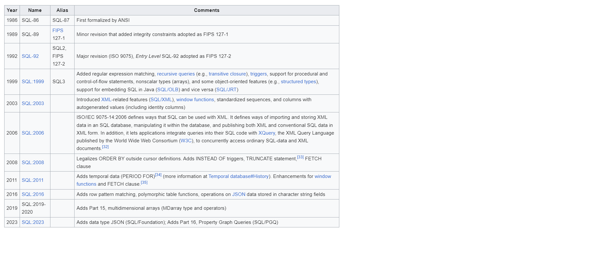

# Concepts
- Database
- Table
- Record/Row
- Column
- SQL
- Data Type
- Index
- Constraints
- DDL
- DML


# SQL

# Table
```sql


CREATE TABLE trade_user (
    id BIGINT UNSIGNED NOT NULL AUTO_INCREMENT,
    name VARCHAR(20) NOT NULL,
    email LONGTEXT,
    age TINYINT UNSIGNED,
    birthday DATETIME,
    created_at DATETIME,
    updated_at DATETIME,
    PRIMARY KEY (id),
    INDEX idx_name (name) 
);

CREATE TABLE trade_order (
    id BIGINT UNSIGNED NOT NULL AUTO_INCREMENT PRIMARY KEY,
    user_id BIGINT UNSIGNED NOT NULL,
    order_no BIGINT UNSIGNED NOT NULL,
    created_at DATETIME NOT NULL,
    updated_at DATETIME NOT NULL,
    total_amount BIGINT UNSIGNED NOT NULL,
    paied_amount BIGINT UNSIGNED NOT NULL
);


INSERT INTO trade_user (name, email, age, birthday, created_at, updated_at) VALUES
('Alice', 'alice@example.com', 40, '1992-01-10 08:30:00', NOW(), NOW()),
('Bob', 'bob@example.com', 35, '1987-05-20 14:45:00', NOW(), NOW()),
('Charlie', 'charlie@example.com', 25, '1997-08-15 09:00:00', NOW(), NOW()),
('Diana', 'diana@example.com', 28, '1994-04-16 17:30:00', NOW(), NOW()),
('Eva', 'eva@example.com', 32, '1990-11-11 12:00:00', NOW(), NOW()),
('Frank', 'frank@example.com', 40, '1982-12-03 19:15:00', NOW(), NOW());

INSERT INTO trade_order (user_id, order_no, created_at, updated_at, total_amount, paied_amount) VALUES
(1, 1, NOW(), NOW(), 2500, 2500),
(2, 2, NOW(), NOW(), 4500, 4500),
(3, 3, NOW(), NOW(), 3000, 1500),
(4, 4, NOW(), NOW(), 1500, 1500),
(5, 5, NOW(), NOW(), 5200, 5200),
(6, 6, NOW(), NOW(), 1300, 1300);

```

# SELECT


# Indexing

# Optimization

# Solve a problem
1. [leetcode: Second Highest Salary](https://leetcode.com/problems/second-highest-salary/description/)


# Remarks
1. All major SQL databases have their own dialects(方言) （Science and Engineering ^_^）.


2. SQL standards


# References
1. [SQL Standardization](https://en.wikipedia.org/wiki/SQL#Standardization)
2. [MySQL Standards Compliance:8.0](https://dev.mysql.com/doc/refman/8.0/en/compatibility.html)
3. [Difference between database drivers and database dialects](https://stackoverflow.com/questions/2085368/difference-between-database-drivers-and-database-dialects#:~:text=A%20database%20dialect%20is%20a,into%20vendor%20specific%20DDL%2C%20DML.)
4. [The SQL Standard – ISO/IEC 9075:2023 (ANSI X3.135)](https://blog.ansi.org/sql-standard-iso-iec-9075-2023-ansi-x3-135/)
5. [Database Indexing](https://en.wikipedia.org/wiki/Database_index)
6. [DB Design](https://web.csulb.edu/colleges/coe/cecs/dbdesign/dbdesign.php?page=models.html)