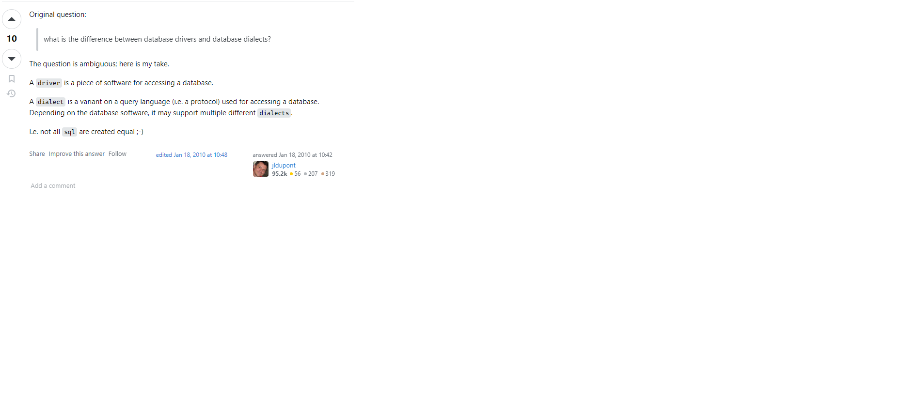

# Concepts
- Database
- Table
- Record/Row
- Column
- SQL
- Data Type
- Index
- Constraints
- DDL
- DML

# SQL

## INSERT

## UPDATE

## DELETE

## SELECT

### Basic

##

# Indexing

# Optimization

# Solve a problem
1. [leetcode: Second Highest Salary](https://leetcode.com/problems/second-highest-salary/description/)

# Remarks
1. All major SQL databases have their own dialects(方言) （Science and Engineering ^_^）.

2. SQL standards

# References
1. [SQL Standardization](https://en.wikipedia.org/wiki/SQL#Standardization)
2. [MySQL Standards Compliance:8.0](https://dev.mysql.com/doc/refman/8.0/en/compatibility.html)
3. [Difference between database drivers and database dialects](https://stackoverflow.com/questions/2085368/difference-between-database-drivers-and-database-dialects#:~:text=A%20database%20dialect%20is%20a,into%20vendor%20specific%20DDL%2C%20DML.)
4. [The SQL Standard – ISO/IEC 9075:2023 (ANSI X3.135)](https://blog.ansi.org/sql-standard-iso-iec-9075-2023-ansi-x3-135/)
5. [Database Indexing](https://en.wikipedia.org/wiki/Database_index)
6. [DB Design](https://web.csulb.edu/colleges/coe/cecs/dbdesign/dbdesign.php?page=models.html)